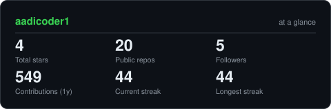

<div align="center">

<!-- NAME / TAGLINE - animated typing -->
<a href="https://github.com/aadicoder1">
  
</a>

<br>

<!-- SOCIALS -->
<a href="https://www.linkedin.com/in/aaditya-kumar-sahu-aadicoder/"></a>
<a href="mailto:aadityasahu1203@gmail.com"></a>
<a href="https://aadicoder1.netlify.app"></a>
<a href="https://leetcode.com/u/aadicoder1"></a>


</div>

---

## `~/` whoami

```console
$ cat about.txt
```

Hi, I'm **Aaditya Kumar Sahu**. I build full-stack web apps using Python and its ecosystem,
and I learn by shipping real things — not just following tutorials.

- Currently finishing **[KMRL SmartDocs](https://github.com/aadicoder1/KMRL_DMS)** — an AI-powered multilingual document intelligence system
- Portfolio: **[aadicoder1.netlify.app](https://aadicoder1.netlify.app)**
- Learning **Java + Spring Boot**
- Fun fact: **I got into coding through a free bootcamp after 12th — best decision I made.**

---

<div align="center">

## `~/` contribution calendar

<!-- 3D isometric calendar -->


<br><br>

<!-- Snake eats the contribution graph -->
<picture>
  <source media="(prefers-color-scheme: dark)"  srcset="https://raw.githubusercontent.com/aadicoder1/aadicoder1/output/snake-dark.svg">
  <source media="(prefers-color-scheme: light)" srcset="https://raw.githubusercontent.com/aadicoder1/aadicoder1/output/snake.svg">
  
</picture>

</div>

---

<div align="center">

## `~/` the numbers

<!-- Generated by scripts/cards.py into this repo. Deliberately NOT
     github-readme-stats / streak-stats / github-profile-trophy: those are
     shared public instances that go down and take the whole section with them. -->
<picture>
  <source media="(prefers-color-scheme: dark)"  srcset="assets/card-stats-dark.svg">
  <source media="(prefers-color-scheme: light)" srcset="assets/card-stats-light.svg">
  
</picture>

<br>


<br><br>


</div>

---

<div align="center">

<sub>`01000010 01110101 01101001 01101100 01100100 01101001 01101110 01100111 00100000 01101111 01101110 01100101 00100000 01100011 01101111 01101101 01101101 01101001 01110100 00100000 01100001 01110100 00100000 01100001 00100000 01110100 01101001 01101101 01100101`</sub>

</div>
